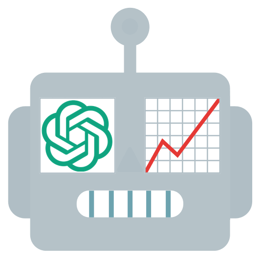

# Robinhood AI Trading Bot



## ⚡ Overview
The **Robinhood AI Trading Bot** is a simple Python script
that combines **OpenAI's intelligence** with **Robinhood's trading capabilities**
to help automate and optimize stock trading decisions.
By analyzing **Relative Strength Index (RSI)**, **Volume-Weighted Average Price (VWAP)**,
**Moving Averages**, and **Robinhood analyst ratings**, the bot generates buy, sell,
and hold recommendations — executing trades automatically based on your selected mode.

## 🤔 Why This Bot?
This project is an experiment
to explore how AI can enhance stock trading decisions — potentially outperforming human traders
(or at least me, The Bot Father).

## ⚠️ Important Considerations
- **Start in Demo or Manual Mode** before enabling Auto Mode.
- **Test thoroughly** to fine-tune AI decision-making.
- **Monitor trade logs** to understand AI-driven actions.

## 🛠 Features
✅ **AI-Driven Trading** – Smart, data-backed buy/sell decisions.  
✅ **Portfolio & Watchlist Integration** – Trade directly from your Robinhood stocks.  
✅ **Configurable Strategy** – Set trading parameters to fit your risk profile.  
✅ **Exclusion List** – Prevent trading specific stocks.  
✅ **Logging & Analytics** – Track bot activity and trading history.  
✅ **Workday Scheduling** – Align trading activity with market hours.

## 🚀 Getting Started
1. **Connect Your Accounts**: Add your OpenAI API key and authenticate with the [Robinhood Trading MCP](https://agent.robinhood.com/mcp/trading) (official Agentic Trading server).
2. **Choose a Mode**:
   - **Demo Mode**: Simulates trades without execution.
   - **Manual Mode**: Requires confirmation before executing trades.
   - **Auto Mode**: Executes trades automatically (recommended only after testing).
3. **Monitor and Adjust**: Review trade logs and fine-tune settings for optimal performance.

## 📊 How It Works
1. **Authenticate**: Connects to OpenAI and the Robinhood Trading MCP via OAuth.
2. **Fetch Data**: Retrieves stocks from your **portfolio** and **watchlist**.
3. **Analyze Market Conditions**:
   - **RSI**: Determines overbought/oversold conditions.
   - **VWAP**: Identifies undervalued/overvalued stocks.
   - **Moving Averages**: Evaluates price trends (50-day and 200-day).
   - **Analyst Ratings**: Incorporates Robinhood's expert opinions.
4. **AI-Driven Decisions**: Uses OpenAI to generate trading recommendations.
5. **Trade Execution**: Buys, sells, or holds stocks based on AI insights.
6. **Continuous Monitoring**: Repeats analysis and trades as the market evolves.

## 📈 Analytical System
### **Relative Strength Index (RSI)**
- Measures momentum on a **0-100 scale**.
- **Above 70**: Overbought (potential sell signal).
- **Below 30**: Oversold (potential buy signal).

### **Volume-Weighted Average Price (VWAP)**
- Calculates the **average price** adjusted for volume.
- **Above VWAP**: Overvalued (potential sell signal).
- **Below VWAP**: Undervalued (potential buy signal).

### **Moving Averages**
- **50-day & 200-day moving averages** help detect trends.
- **Golden Cross (50-day crosses above 200-day)**: Bullish signal.
- **Death Cross (50-day crosses below 200-day)**: Bearish signal.

### **Robinhood Analyst Ratings**
- Aggregates **buy, hold, and sell** recommendations.
- Provides sentiment analysis based on expert insights.

## 🤖 AI-Powered Decision Making
The bot formulates decisions using OpenAI based on:
- RSI, VWAP, moving averages, and analyst ratings.
- User-defined constraints (e.g., budget, stock exclusions, portfolio size).
- Pattern Day Trading (PDT) status to prevent PDT designation.

### **Example AI Prompt**:
``````
**Context:**
Today is 2025-02-03T12:23:02Z.
You are a short-term investment advisor managing a stock portfolio.
You analyze market conditions every 3600 seconds and make investment decisions.

**Constraints:**
- Initial budget: 0.22 USD
- Max portfolio size: 20 stocks
- Excluded stocks: VOO, SPY, IVV

**Stock Data:**
```json
{
 "AAPL": {
  "current_price": 226.79,
  "my_quantity": 0.0927,
  "my_average_buy_price": 226.43,
  "rsi": 40.47,
  "vwap": 228.41,
  "50_day_mavg_price": 240.23,
  "200_day_mavg_price": 219.7,
  "analyst_summary": {
   "num_buy_ratings": 30,
   "num_hold_ratings": 17,
   "num_sell_ratings": 5
  },
  "analyst_ratings": [
   {
    "published_at": "2025-02-01T01:13:18Z",
    "type": "sell",
    "text": "Regulators have a keen eye on Apple, and recent regulations have chipped away at parts of Apple\u2019s sticky ecosystem. "
   },
   {
    "published_at": "2025-02-01T01:13:18Z",
    "type": "sell",
    "text": "Apple\u2019s supply chain is highly concentrated in China and Taiwan, which opens up the firm to geopolitical risk. Attempts to diversify into other regions may pressure profitability or efficiency."
   },
   {
    "published_at": "2025-02-01T01:13:18Z",
    "type": "sell",
    "text": "Apple is prone to consumer spending and preferences, which creates cyclicality and opens the firm up to disruption."
   },
   {
    "published_at": "2025-02-01T01:13:18Z",
    "type": "buy",
    "text": "Apple has a stellar balance sheet and sends great amounts of cash flow back to shareholders."
   },
   {
    "published_at": "2025-02-01T01:13:18Z",
    "type": "buy",
    "text": "We like Apple\u2019s move to in-house chip development, which we think has accelerated its product development and increased its differentiation. "
   },
   {
    "published_at": "2025-02-01T01:13:18Z",
    "type": "buy",
    "text": "Apple offers an expansive ecosystem of tightly integrated hardware, software, and services, which locks in customers and generates strong profitability."
   }
  ]
  "is_buy_pdt_restricted": false,
  "is_sell_pdt_restricted": false
 },
 ...
}
```

**Response Format:**
Return your decisions in a JSON array with this structure:
```json
[
  {"symbol": <symbol>, "decision": <decision>, "quantity": <quantity>},
  ...
]
```
- <symbol>: Stock symbol.
- <decision>: One of `buy`, `sell`, or `hold`.
- <quantity>: Recommended transaction quantity.

**Instructions:**
- Provide only the JSON output with no additional text.
- Return an empty array if no actions are necessary.
``````

AI-response example:
```
[
    {"symbol": "AAPL", "decision": "sell", "quantity": 0.564172},
    {"symbol": "BL", "decision": "hold", "quantity": 0.0},
    {"symbol": "EQIX", "decision": "buy", "quantity": 1.0},
    ...
]
```

### Pattern Day Trading (PDT) Protection
The bot includes built-in protection against Pattern Day Trading (PDT) designation:
- Automatically checks PDT status for each stock
- Prevents day trades when PDT restricted
- Includes PDT information in AI decision-making

For more information about PDT rules, visit: [Robinhood Pattern Day Trading](https://robinhood.com/us/en/support/articles/pattern-day-trading/)

## 📝 Logging System
The bot logs its activity and trading decisions in a console log.

### **Example Log Output**:
```
Are you sure you want to run the bot in auto mode? (yes/no): yes
[2024-11-01 11:06:58] [INFO]    Market is open, running trading bot in auto mode...
[2024-11-01 11:06:58] [INFO]    Getting portfolio stocks...
[2024-11-01 11:07:02] [INFO]    Portfolio stocks to proceed: NVDA (1.07%), MSFT (0.12%), SNAP (0.25%), NWSA (13.71%), ...
[2024-11-01 11:07:02] [INFO]    Prepare portfolio stocks for AI analysis...
[2024-11-01 11:07:07] [INFO]    Getting watchlist stocks...
[2024-11-01 11:07:08] [INFO]    Watchlist stocks to proceed: VRT, BB, VRNT, PBI, BMBL, IESC, WB, LITE, ...
[2024-11-01 11:07:08] [INFO]    Prepare watchlist overview for AI analysis...
[2024-11-01 11:07:09] [INFO]    Making AI-based decision...
[2024-11-01 11:07:21] [INFO]    Executing decisions...
[2024-11-01 11:07:21] [INFO]    NVDA > Decision: sell of 2.012
[2024-11-01 11:07:21] [ERROR]   NVDA > Sold 2.012 stocks
[2024-11-01 11:07:21] [INFO]    MSFT > Decision: sell of 1.5422
[2024-11-01 11:07:21] [ERROR]   MSFT > Error selling: Not enough shares to sell.
[2024-11-01 11:07:22] [INFO]    VRT > Decision: buy of 2.09
[2024-11-01 11:07:23] [INFO]    VRT > Bought 2.09 stocks
[2024-11-01 11:07:23] [INFO]    SNAP > Decision: hold of 0.0323
[2024-11-01 11:07:23] [INFO]    VIAV > Decision: hold of 0.0212
[2024-11-01 11:07:24] [INFO]    Stocks sold: NVDA (2.0)
[2024-11-01 11:07:24] [INFO]    Stocks bought: VRT (2.09)
[2024-11-01 11:07:24] [INFO]    Errors: MSFT (Not enough shares to sell.)
[2024-11-01 11:07:24] [INFO]    Waiting for 600 seconds...
```

## 🛠️ Setup Guide
### Installation
1. Clone the repository:
    ```sh
    git clone https://github.com/siropkin/robinhood-ai-trading-bot.git
    cd robinhood-ai-trading-bot
    ```

2. Install dependencies:
    ```sh
    pip install -r requirements.txt
    ```


### Configuration
Copy the example config and update it with your details::
   ```sh
   cp config.py.example config.py
   ```

Fill in config.py with the required parameters:
```python
# Credentials
OPENAI_API_KEY = "..."                      # OpenAI API key

# Robinhood MCP (official Agentic Trading server)
ROBINHOOD_MCP_URL = "https://agent.robinhood.com/mcp/trading"
ROBINHOOD_MCP_TOKEN_PATH = ".robinhood_mcp_tokens.json"

# Basic config parameters
MODE = "demo"                               # Trading mode (demo, auto, manual)
LOG_LEVEL = "INFO"                          # Log level (DEBUG, INFO)
RUN_INTERVAL_SECONDS = 600                  # Trading interval in seconds (if the market is open)

# Robinhood config parameters
TRADE_EXCEPTIONS = []                       # List of stocks to exclude from trading (e.g. ["AAPL", "TSLA", "AMZN"])
WATCHLIST_NAMES = []                        # Watchlist names (can be empty, or "My First List", "My Second List", etc.)
WATCHLIST_OVERVIEW_LIMIT = 10               # Number of stocks to process in decision-making (e.g. 20)
PORTFOLIO_LIMIT = 10                        # Number of stocks to hold in the portfolio
MIN_SELLING_AMOUNT_USD = 1.0                # Minimum sell amount in USD (False - disable setting)
MAX_SELLING_AMOUNT_USD = 10.0               # Maximum sell amount in USD (False - disable setting)
MIN_BUYING_AMOUNT_USD = 1.0                 # Minimum buy amount in USD (False - disable setting)
MAX_BUYING_AMOUNT_USD = 10.0                # Maximum buy amount in USD (False - disable setting)

# OpenAI config params
OPENAI_MODEL_NAME = "gpt-4o-mini"           # OpenAI model name
```

#### Robinhood MCP Setup
This bot uses Robinhood's official [Agentic Trading MCP server](https://agent.robinhood.com/mcp/trading) instead of username/password login.

1. Open and fund a **Robinhood Agentic account** on desktop ([setup guide](https://robinhood.com/us/en/support/articles/agentic-trading-overview/)).
2. On first run, the bot opens a browser for OAuth. Complete sign-in and authorize the connection.
3. Tokens are cached in `.robinhood_mcp_tokens.json` for future runs.

**Cursor integration (optional):** Add the same MCP URL in **Cursor Settings → Tools & MCPs → Connect**:
`https://agent.robinhood.com/mcp/trading`

**Important:** Trades are placed only in your Agentic account, not your primary Robinhood portfolio. Analyst ratings are not available via MCP; RSI/VWAP/moving averages use Yahoo Finance historical data.

### Running the Bot
Start the bot with:
   ```sh
   python main.py
   ```

### Continuous Deployment (Live Trading)
The bot defaults to **auto mode** for live trading in your Agentic account. Set `AUTO_CONFIRM=true` in `.env` to skip the startup prompt for unattended runs.

**Docker (recommended for 24/7):**
```sh
docker compose up -d --build
docker compose logs -f
```

**Windows (foreground):**
```powershell
.\scripts\run.ps1
```

Before deploying live, authenticate Robinhood MCP locally (`python scripts/auth_robinhood.py`) so `.robinhood_mcp_tokens.json` exists. Mount or keep that file alongside the bot for token refresh.

## ⚠️ Disclaimer
Please note: This bot is designed solely for educational purposes.
Trading stocks involves significant risks, and you should only invest money you can afford to lose.
The author is not liable for any financial losses incurred through the use of this bot.

## 📄 License
This project is licensed under the MIT License. See the [LICENSE](LICENSE) file for details.

## 🤝 Contributing
Contributions are highly encouraged and welcomed!
Whether you're looking to enhance the logging system, optimize AI-prompt strategies,
or enrich stock data — there's always room for fresh ideas and improvements.
Feel free to submit pull requests or open issues to share your suggestions and expertise!

## 📧 Contact
Got questions, feedback, or just want to chat?
Reach out via email at [goodbotty@proton.me](mailto:goodbotty@proton.me).
I'm always happy to hear from you!
